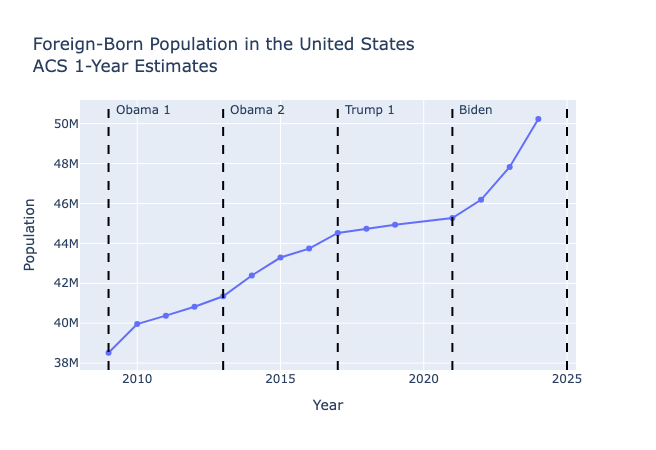
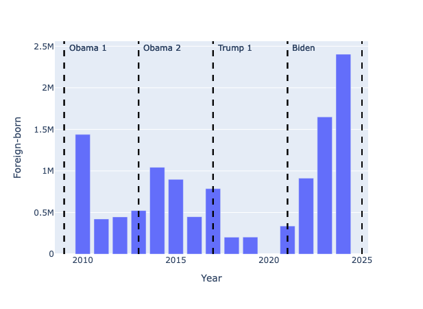

# acs-nativity

`acs-nativity` is a Python package for analyzing immigration trends from the American Community Survey (ACS) as a time series. It provides a simple interface for downloading and visualizing data on the native and foreign-born population.

A key feature of the package is that it returns the data as a historical time series covering the full span of ACS 1-year estimates (2005-2024). Under the hood, the package harmonizes two ACS tables - `B05002` (2005-2008) and `B05012` (2009 onward) - so users receive a single consistent dataset covering the entire period. The Census Bureau did not release ACS 1-year estimates in 2020, so that year is not in the series. The 2025 ACS 1-year estimates are expected to be released in September 2026.

The ACS 1-year estimates are available for many geographies across the United States. As the Census Bureau explains:

> The ACS 1-year estimates are available for the nation, all states, the District of Columbia, Puerto Rico, all congressional districts and metropolitan statistical areas, and all counties and places (i.e., towns or cities) with populations of 65,000 or more.

`acs-nativity` makes it easy to work with data for any geography supported by the ACS 1-year estimates.

The package exposes three functions:

  * `get_nativity_timeseries()` - Downloads ACS nativity data and returns a dataframe covering all available ACS 1-year estimates for the given geography.
  * `plot_nativity_timeseries()` - Creates a time series visualization of nativity data.
  * `plot_nativity_change()` - Creates a bar chart showing the year-to-year change in a nativity measure.

## Installation

Install directly from GitHub:

```sh
pip install git+https://github.com/arilamstein/acs-nativity.git
```

## Example Workflow

The code below will get nativity data for the entire country:
```python
from acs_nativity import (
    get_nativity_timeseries,
    plot_nativity_timeseries,
    plot_nativity_change,
)

df = get_nativity_timeseries(us="*")
df.head(1)
```
```text
   Name           Year  Total      Native     Foreign-born  Percent Foreign-born
0  United States  2005  288378137  252688295  35689842      12.376057
```
The parameter `us="*"` tells `get_nativity_timeseries` to return data for the entire country. The key columns are `Total`, `Native`, `Foreign-born`, and `Percent Foreign-born`. Those columns are provided for all geographies.

To plot a time series of the dataframe, call `plot_nativity_timeseries` and specify the column you want to chart. Most chart details (e.g., title and axis labels) are handled automatically, and annotations show when presidential administrations changed.

```python
plot_nativity_timeseries(df, column="Foreign-born")
```
 
The foreign-born population has increased steadily since 2005, with a particularly large increase during the Biden administration.

Sometimes it is helpful to show the year-over-year changes instead of raw values. To do that, call `plot_nativity_change` with a dataframe and a column: 
```python
plot_nativity_change(df, column="Foreign-born")
```



Here we can see that the only year when the foreign-born population decreased was 2008.

## Learning More

To learn more about how to use `acs-nativity`, including how to work with other geographies (such as states, counties, and cities), see the [Getting Started Notebook](notebooks/getting_started.ipynb).